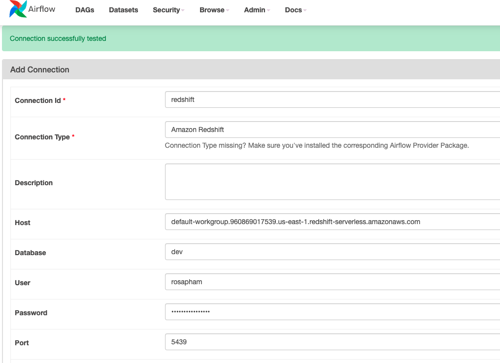

# Sparkify Analysis - Airflow AWS

## Overview

A music streaming company, Sparkify, has decided that it is time to introduce more automation and monitoring to their data warehouse ETL pipelines and come to the conclusion that the best tool to achieve this is Apache Airflow.

They have decided to bring you into the project and expect you to create high grade data pipelines that are dynamic and built from reusable tasks, can be monitored, and allow easy backfills. They have also noted that the data quality plays a big part when analyses are executed on top the data warehouse and want to run tests against their datasets after the ETL steps have been executed to catch any discrepancies in the datasets.

The source data resides in S3 and needs to be processed in Sparkify's data warehouse in Amazon Redshift. The source datasets consist of JSON logs that tell about user activity in the application and JSON metadata about the songs the users listen to.


## Dataset

- Log data: s3://udacity-dend/log-data
- Song data: s3://udacity-dend/song-data
- Log path: s3://udacity-dend/log_json_path.json

## Project Steps

1. Create an IAM User in AWS.
   Set permissions to this user:

- AdministratorAccess
- AmazonRedshiftFullAccess
- AmazonS3FullAccess

2.  Connect Airflow and AWS.


3. Configure Redshift Serverless in AWS.

- Create Redshift Role in AWS Console

```bash
aws iam create-role --role-name my-redshift-service-role --assume-role-policy-document '{
    "Version": "2012-10-17",
    "Statement": [
        {
            "Effect": "Allow",
            "Principal": {
                "Service": "redshift.amazonaws.com"
            },
            "Action": "sts:AssumeRole"
        }
    ]
}'
```

- Provide the full access to S3

```bash
aws iam attach-role-policy --policy-arn arn:aws:iam::aws:policy/AmazonS3FullAccess --role-name my-redshift-service-role
```

- Create a Redshift Cluster
- Turn on Publicly accessible for Redshift Workgroup and Redshift Cluster
- Add more inbound rule for the VPC security group in Redshift Workgroup.


4. Connect Airflow to AWS Redshift Serverless



5. Copy S3 data
   The data for the project is stored in Udacity's S3 bucket. This bucket is in the US West AWS Region. To simplify things, we will copy the data to your bucket in the same AWS Region where you created the Redshift workgroup so that Redshift can access the bucket.

- Copy the data from the udacity bucket to our bucket:

```bash
aws s3 sync s3://udacity-dend/log-data/ s3://sparkify-lake-house/log-data/
aws s3 sync s3://udacity-dend/song-data/ s3://sparkify-lake-house/song-data/
aws s3 cp s3://udacity-dend/log_json_path.json ~/
aws s3 cp ~/log_json_path.json s3://sparkify-lake-house/
```
